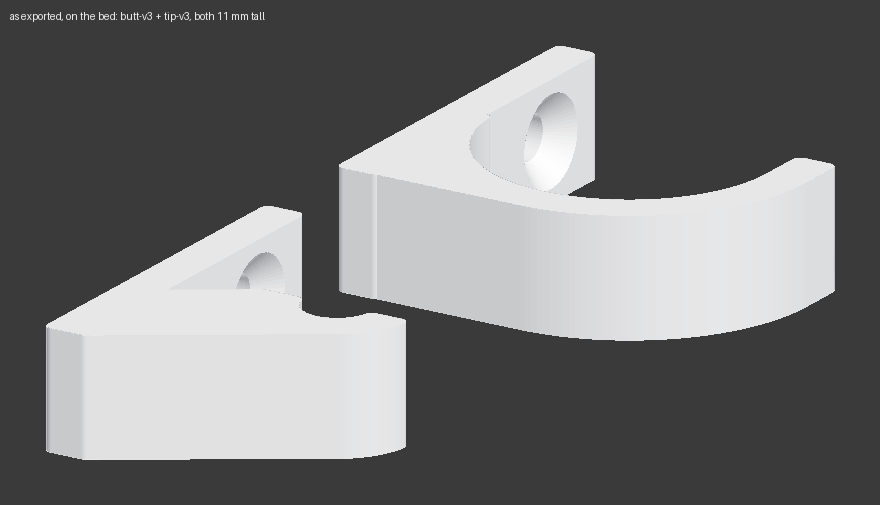

# Low-profile floating fishing rod mounts

Wall mounts that hold a rod horizontally with as little visible hardware as
physically possible. Two per rod: a thin curved rib that wraps the grip, and a
smaller one carried out from the wall on a tapered wedge for the blank.

Shape follows `reference/wall_hook_for_3mm_screw(2).stl` — thin plate, curved rib,
triangular gusset — rebuilt parametrically rather than scaled.



## Print these

One pair per rod. They share a 35 mm backplate, one screw hole at the same
height, and the same 11 mm slab thickness, so the two read as a set on the
wall.

| File | Size | Volume | Screws |
|---|---|---|---|
| **`output/fishing-rod-mounts/spinning-85in-butt-26.15mm-v3.stl`** | 35.4 × 35 × 11 mm | 3.9 cm³ | 1 |
| **`output/fishing-rod-mounts/spinning-85in-tip-5.80mm-v3.stl`** | 25.1 × 35 × 11 mm | 3.6 cm³ | 1 |

The butt mount is 35.4 mm deep against the tip's 25.1 mm, and that gap cannot
close: it is the 26.15 mm grip plus wall clearance plus the retaining rib.
Every other dimension now matches.

The tip mount's saddle and the wedge beneath it are both angled at **32.60°**.
That angle is forced, not chosen: the upper line must reach the top of the
cradle's wall-side wall and the lower one starts at the backplate's bottom
corner, so parallel + tangent to the crescent determines it.

### Slicer settings

Drop them into Bambu Studio and **do not rotate them.** They are exported
already lying in the correct orientation, which matters more than usual: the
part is a 2D profile extruded sideways, so this way it has zero overhangs — no
supports, nothing to clean out of the cradle — *and* the layer lines run across
the cantilever instead of along the plane the rod's weight would try to split.
Standing it upright would print worse and break easier.

- **PETG** preferred, PLA acceptable. PLA creeps under sustained load; at these
  stresses it will survive, but PETG is better for something loaded constantly.
- 0.2 mm layer height
- **4 wall loops** — the load is carried by the walls, not the infill
- 30 % infill, no supports, no brim needed

## Hang them

**Rotate each rod so the reel and guides point downward.** On both spinning and
casting rods the guides sit on the same side as the reel, so this is what puts
bare blank against the wall and lets the mounts stay close. The reel's weight
also self-rotates the rod into that position once it's in the cradle.

Both mounts share an **identical backplate** — same height, same screw holes,
same cradle-center height. So:

1. Mark a level horizontal line where you want the **bottom edge** of both
   mounts. Bottom edges aligned = rod level and parallel to the wall. There is
   no angle to work out at install time.
2. The screw hole sits **27.5 mm above that line**, centered.
3. Butt mount at the spot on the grip you measured; tip mount roughly 1440 mm
   further along (⅔ of the 85″ rod).
4. Leave **at least 150 mm of clear wall below** the line — the spinning reel
   hangs 133 mm below the rod.
5. #6 or #8 × 1¼″ flat-head screws into drywall anchors. Countersinks are on
   the front face so the heads finish flush.

With one screw you have to hold each mount level while you tighten it. Once
tight it stays put: the hanging rod applies roughly 96 N·mm of twist about the
screw, and friction between the plate and the wall under a tightened screw
resists that by more than an order of magnitude.

The back face is a flat unbroken pad, so double-sided tape works for a trial
hang before you commit to drilling. Clean the wall with alcohol first.

Optional: a scrap of adhesive felt in the cradle protects the grip finish.

## Changing the numbers

Everything derives from two measurements per rod. Edit `RODS` at the top of
`catalog.py`:

```python
RODS = [
    Rod(name="spinning-85in", butt_dia=26.15, tip_dia=5.80),
    Rod(name="baitcaster", butt_dia=00.00, tip_dia=0.00),
]
```

Then, from the repo root:

```sh
uv run build fishing-rod-mounts   # regenerate STLs into output/
uv run verify                     # check geometry before printing
uv run pytest                     # check the code
```

`uv run verify` is worth running after any change. It checks the things that
are easy to break and hard to spot: that the rod still lifts straight out, that
it is trapped sideways in both directions, that the screw bores are open and
countersunk on the front only, and that both mounts still seat the rod
centerline at the same height (17.22 mm in both, measured off the actual solids
rather than read back from the parameters).

The test suite covers the code rather than the physics. Its centerpiece is a
golden master: `LOCKED.txt` holds the sha256 of both shipped STLs, the
generator is deterministic, and the suite rebuilds the pair and compares.
Anything that moves a single vertex fails immediately — so if you are changing
the *shape* on purpose, expect that test to fail, and re-lock with:

```sh
shasum -a 256 output/fishing-rod-mounts/*.stl \
    > src/printing3d/fishing_rod_mounts/LOCKED.txt
```

### The files

| File | What lives there |
|---|---|
| `catalog.py` | The rods, the two mount styles, and what gets printed |
| `geometry.py` | The parametric shape: the cradle, the supports, the profile |
| `verify.py` | Geometric checks against the built solids |
| `reference/` | The original wall hook the shape follows, and a photo of the pair |

Binary STL writing and output paths are shared across the repo and live in
`printing3d/stl.py` and `printing3d/parts.py`.

## How it works

Parameterized on the **rod's centerline**, not on the standoff. `AXIS_U = 18.0`
puts the centerline 18 mm from the wall in *both* mounts; each cradle's depth
is whatever it takes to get there.

| | butt | tip |
|---|---|---|
| rod diameter | 26.15 mm | 5.80 mm |
| material between wall and rod | 4.62 mm | 14.80 mm |
| projection from wall | 35.38 mm | 25.20 mm |

That 4.6 → 14.8 mm difference is the extra offset the tip mount needs so the
handle doesn't sit further out than the tip. It's derived, not eyeballed.

Three constraints shape the rest:

**The plate can't be thicker than 4 mm.** The rod is a long cylinder, so it
can't dodge an obstruction — anything above the cradle sitting further from the
wall than the rod's near surface blocks it from lifting out, anywhere along its
length. `AXIS_U` is set so a uniform 4 mm plate clears the rod by ~0.9 mm,
which is also just enough to countersink a flat head properly.

**The screws have to be above the rod.** A weight hanging out from the wall
always tries to peel the *top* of the plate off, pivoting about the bottom
edge. Screws below the load would be in compression and do nothing.

**Projection is set by the rod, not the mount.** 35.4 mm at the butt is a
26.15 mm grip plus wall clearance plus a 4 mm retaining rib — there is very
little fat left to remove. What the rib-and-gusset structure buys is visual
lightness and material: 32 % less than a solid cradle on the butt mount, 50 %
less on the tip.
